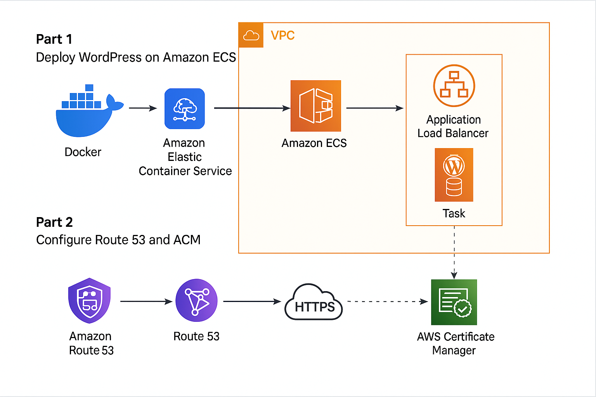

# Deploying-WordPress-on-Amazon-ECS

Deploying WordPress on Amazon ECS

Part 1: Deploy a WordPress Containerized Application on Amazon ECS

This project is part of a hands-on AWS series where we walk through deploying scalable, secure, and production-ready web applications using AWS services.

🚀 Project Overview

In Part 1, we deploy a WordPress container on Amazon Elastic Container Service (ECS) using Fargate. The goal is to containerize WordPress, run it serverlessly using Fargate, and configure it to scale and withstand real-world traffic.

🛠️ What You'll Learn

How to containerize a WordPress application using Docker

How to define ECS task and service definitions

How to deploy your WordPress container with ECS and Fargate

How to use an Application Load Balancer to route traffic

How to configure networking using VPC, subnets, and security groups

How to log application activity using Amazon CloudWatch

🧰 Technologies Used

Docker

Amazon ECS (Fargate Launch Type)

Amazon Elastic Container Registry (ECR)

Amazon RDS or MySQL Container

Amazon CloudWatch Logs

Amazon VPC, Subnets, and Security Groups

Application Load Balancer (ALB)

📁 Project Structure

aws-wordpress-ecs/
├── Dockerfile
├── docker-compose.yml (optional for local dev)
├── ecs-task-definition.json
├── ecs-service-config.json
├── terraform/ or cloudformation/ (optional IaC)
├── README.md
└── architecture-diagram.png

📦 Step-by-Step Guide

1. Containerize WordPress

Use the official wordpress:latest image. Optionally build your own image.

FROM wordpress:latest
COPY . /var/www/html

2. Push Image to Amazon ECR

ecr-login
$(aws ecr get-login --no-include-email)
docker tag wordpress <account-id>.dkr.ecr.<region>.amazonaws.com/wordpress

3. Create ECS Task Definition

Define CPU/memory

Set container port mappings

Use CloudWatch logging

4. Create ECS Service

Launch type: Fargate

Use ALB to route external traffic

Place service in public subnets

5. Set Up Load Balancer

Listener on port 80

Target group for WordPress ECS service

6. Test Your WordPress App

Access your app using the ALB DNS name (e.g., http://your-alb-123456.elb.amazonaws.com).

Part 2: Connect Route 53 and Secure with ACM

🔒 Goal

Secure your WordPress website with HTTPS using:

Amazon Route 53 for DNS

AWS Certificate Manager (ACM) for SSL/TLS

🧭 What You'll Learn

How to register or import your domain into Route 53

How to request and validate an ACM certificate

How to configure Route 53 DNS records to point to your ALB

How to attach SSL certificates to the ALB listener

📝 Steps

Request Certificate

Go to ACM

Choose DNS validation

Add CNAME to Route 53 hosted zone

Update Route 53 DNS

Create A record (Alias) pointing to ALB DNS

Propagate changes

Attach SSL to ALB

Modify ALB listener to include HTTPS

Use the validated ACM certificate

Test Secure Access

Visit https://yourdomain.com

Ensure padlock is visible

🖼️ Architecture Diagram

See the architecture-diagram.png file in this repo for a full system overview, including ECS, ALB, Route 53, and ACM integration.

🧹 Cleanup Resources

To avoid AWS charges:

Delete ECS services and clusters

Deregister task definitions

Remove ALB and target groups

Delete ACM certificates if unused

Clean up Route 53 records and hosted zones

📌 Next Steps

In future parts of the series, we’ll cover:

Auto scaling for ECS services

Backing up and restoring the WordPress database

Adding CI/CD pipelines for container deployment
